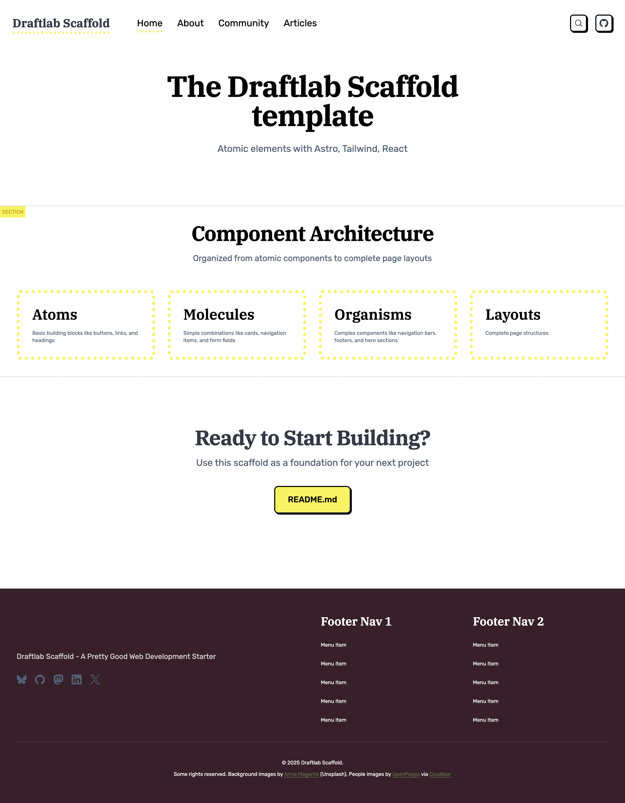
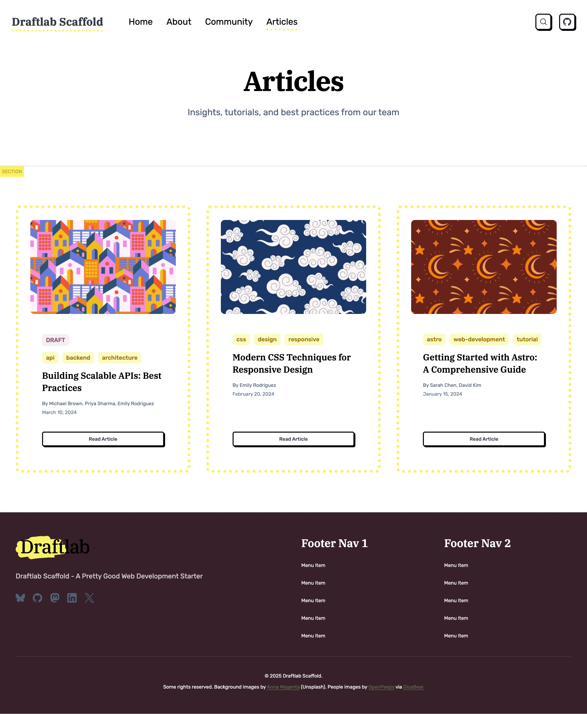
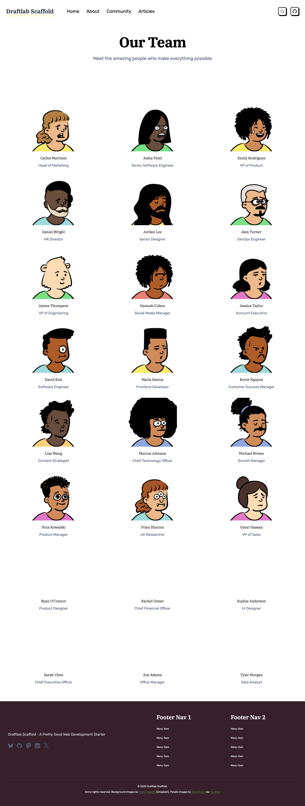
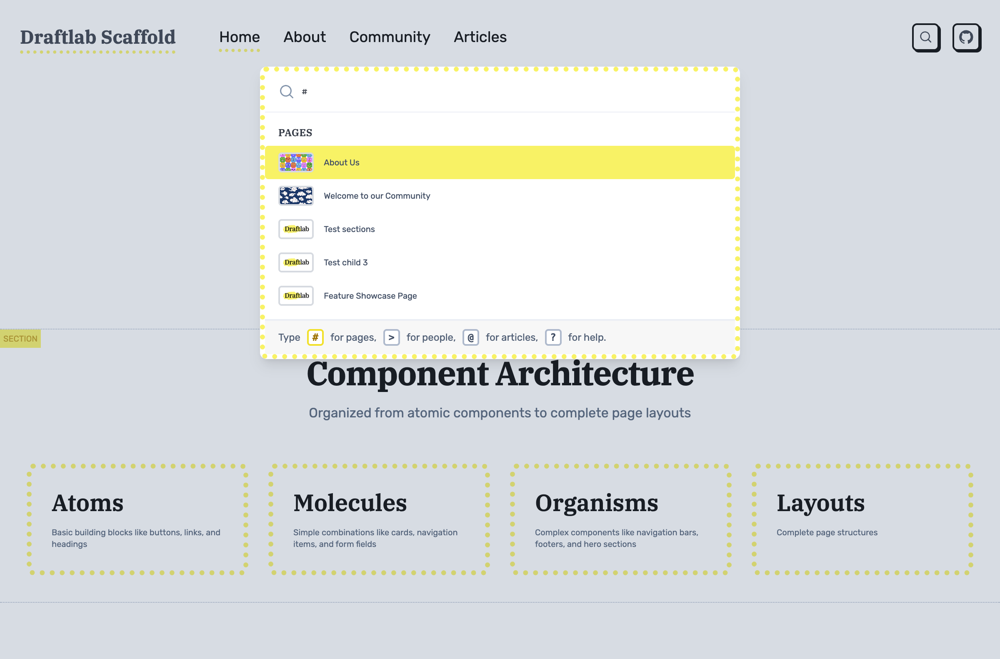

# Draftlab Scaffold

A modern, content-focused web template built with Astro v7, Tailwind CSS v4, and React v19. This scaffold provides a flexible page-building system with reusable components, type-safe content collections, and an integrated headless CMS.

[](https://app.netlify.com/projects/draftlab-scaffold/deploys)

## Installation

Create a new project using this template:

```sh
npx create-astro --template draftlab-org/scaffold
cd your-project-name
npm install
npm run dev
```

Or clone and install manually:

```sh
git clone https://github.com/draftlab-org/scaffold.git
cd scaffold
npm install
npm run dev
```

## Updating to a newer Scaffold version

Scaffold is designed to be forked. Once you've replaced the demo content with your own, you can still pull future Scaffold improvements (components, layouts, utils, tooling) without losing the work you've done.

Add Scaffold as a remote (one-time):

```sh
git remote add template https://github.com/draftlab-org/scaffold.git
```

Then, whenever you want updates:

```sh
npm run update-from-scaffold
```

That's it. The script handles `--allow-unrelated-histories` on the first merge, re-applies any deletions you've made in protected paths (so demo content doesn't reappear via modify/delete conflicts), and auto-removes any brand-new upstream files in `src/content/`, `src/assets/`, and `public/` (to keep our demo content out of your production site). If the merge changes `package.json` dependencies, the script will remind you to run `npm install`. It also re-syncs the category dropdowns in `.pages.yml` from your own `src/content/categories/` files (see [Category dropdowns](#category-dropdowns)).

Upgrading from an older Scaffold? Read [UPGRADING.md](./UPGRADING.md) for breaking changes and content migrations.

### What's protected

Scaffold ships a `.gitattributes` file that marks these paths as **downstream-wins** on merge — your version is always kept:

- `src/content/**` — all content collections (pages, articles, people, etc.)
- `src/assets/**` — uploaded images, logos, artwork
- `src/styles/**` — your theme tokens, typography, component utilities
- `public/**` — favicons, OG images, robots.txt, and anything else you've added there
- `fonts.config.mjs` — your font choices (see "Changing fonts" below)

Everything else merges normally. Real code conflicts get flagged like any merge, and the script stops so you can resolve them by hand.

### New upstream files and content collections

When upstream adds a brand-new file in `src/content/`, `src/assets/`, or `public/`, the script removes it as part of the merge. Demo content shouldn't sneak into your production site, and you can always add your own files later.

Brand-new files in `src/styles/` are *not* auto-removed — new stylesheets may be required by new components in the merge.

Styles that Scaffold's own components need (dark sections, section headings, the logo wall, TOC, heading anchors) live in `src/styles/scaffold.css`, imported by `BaseLayout`. Because `src/styles/**` is `merge=ours`, Scaffold changes to *your* stylesheets never reach you — so leave `scaffold.css` untouched and override its rules in your own files, and updates keep flowing into it.

If Scaffold ships an entirely new **content collection** (a new directory under `src/content/`), you'll see a notice at the end of the run:

```
ℹ There are new content collections on Scaffold — check out https://scaffold.org to see what's new
```

The collection's schema arrives via `src/content.config.ts` (which isn't protected and merges in normally); the demo files in the new directory are removed. If you want to use the new collection, head to scaffold.org to see what it is, then add your own content under that directory.

### If you forked before this update script existed

Git reads `.gitattributes` from the working tree *at the start* of a merge, so existing forks need a one-time bootstrap to land the protection rules and the script itself:

```sh
git fetch template
git checkout template/main -- .gitattributes scripts/scaffold-update.sh
git commit -m "Adopt Scaffold update script"
bash scripts/scaffold-update.sh
```

Then add the npm shortcut to your `package.json` scripts so you don't have to remember the bash path:

```json
"update-from-scaffold": "bash scripts/scaffold-update.sh"
```

After this, `npm run update-from-scaffold` is all you need.

### Doing it without the script

If you'd rather invoke Git directly, the equivalent is:

```sh
git config merge.ours.driver true   # one-time: register the 'ours' merge driver
git fetch template
git merge template/main             # first run: add --allow-unrelated-histories -X theirs
```

The `merge.ours.driver` line is required — `.gitattributes` references `merge=ours`, but `ours` isn't a built-in Git driver, so without this config Git falls back to a 3-way merge and conflicts every protected file. For the first merge after `npx create-astro` there's no shared history, so every diverged file is an add/add conflict; `-X theirs` resolves those in favour of upstream while protected paths still keep your version. You'll also be on your own for modify/delete conflict resolution and new-file review.

## Stack

The template combines Astro v7 for static site generation with Tailwind CSS v4 for styling and React v19 for interactive components. Content is managed through Astro's type-safe content collections (Content Layer API) with Pages CMS providing a visual editing interface. The build includes automatic image optimization and is preconfigured for Netlify deployment. Requires Node.js v22.12+.

## Screenshots

### Homepage
The homepage showcases the component architecture with a clean hero section and visual representation of atomic design principles.



### Articles
The articles page displays blog posts in a card grid layout with hero images, categories, author information, and publication dates.



### People Directory
The people page features team members in a responsive grid with avatars, names, and titles.



### Rich Search
The rich search module provides full-text fuzzy search across all content types, with highlighted match snippets, keyboard shortcuts and category filters.



## Architecture

### Component System

We are following atomic design principles described by Brad Frost (https://atomicdesign.bradfrost.com/chapter-2/) to make it easier to manage our components:


Components are organized from simple to complex in `src/components/`. Atoms like Button and Image are basic building blocks. Molecules combine atoms into simple patterns like Card. Organisms such as Hero and Navigation are complex, standalone components. Sections are full-width page blocks that combine organisms and molecules into complete interface sections.

### Development Utilities

The `DevOnly` component and `devClass` utility help manage development-only UI elements. Wrap any content in `<DevOnly>` to remove it from production builds. Use `devClass('classes')` to apply Tailwind classes only in development.

```astro
import DevOnly from '@components/atoms/DevOnly.astro'; import {devClass} from '@utils/dev';

<DevOnly><span>Debug info</span></DevOnly>
<div class={`base ${devClass('border-2 border-red-500')}`}></div>
```

### Content Collections

Content lives in `src/content/` with schemas defined in `src/content.config.ts` using Astro's Content Layer API. The scaffold includes nine content collections:

**Site Configuration** (`src/content/site/config.json`) - Global site settings including title, description, default SEO images, social media links, favicon, cookie consent configuration, analytics, share buttons, breadcrumbs, and archived banner settings. This serves as the single source of truth for site-wide metadata and is fully editable through Pages CMS.

**Pages** (`src/content/pages/`) - YAML files where each file becomes a route. Pages contain a sections array that you can populate with any combination of the section types listed under [Page Building](#page-building).

**Navigation** (`src/content/navigation/`) - JSON files defining menu structures. Includes main navigation and footer menus (`footer-1`, `footer-2`). Menus nest up to three levels: a dropdown holds links and labelled groups of links. Breadcrumbs are derived from the same menus.

**People** (`src/content/people/`) - Team member information as individual JSON files with headshots, titles, department tags, and optional social links.

**Partners** (`src/content/partners/`) - Partner organizations as individual JSON files with name, logo, URL, one or more categories, display order, and featured flag. Partners have individual detail pages at `/partners/[id]`.

**Articles** (`src/content/articles/`) - Markdown blog posts with frontmatter including permalink, authors, categories, status, hero images, and optional related articles and resources. Article pages get a sticky table of contents, share links, and related content.

**Docs** (`src/content/docs/`) - Markdown documentation pages organized into chapters. Each doc has a permalink, title, chapter label, chapterOrder, and order — used to build a structured, multi-chapter documentation section with navigation at `/docs/[slug]`.

**Resources** (`src/content/resources/`) - Data collection for publications like reports, whitepapers, case studies, and guides. Each resource has a title, category, year, optional contributors (linked to people), external links, tags, and optional related resources. Resources have individual detail pages at `/resources/[id]` with cross-links to contributor profiles.

**Categories** (`src/content/categories/`) - Category definitions for articles, people, partners, and resources. Used by filter components across the site, validated in the schema, and synced into the CMS dropdowns (see [Category dropdowns](#category-dropdowns)).

All collections support a unified **status field** (`draft`, `published`, `archived`). Drafts are only visible in development and preview modes. Published and archived items are always visible.

Images use absolute paths from the project root (`/src/assets/...`) for consistency. The image() helper in content collections automatically resolves and optimizes these at build time. Images inside article and doc **bodies** use paths relative to the markdown file (`../../assets/...`) — the `body-images` media entry in `.pages.yml` writes these for you.

### Page Building

The dynamic route at `src/pages/[...slug].astro` renders pages from the Pages collection. Each page is assembled from sections in the order they appear in the YAML file. To create a new page, add a YAML file to `src/content/pages/` and the route appears automatically.

Section types are defined as a discriminated union in the content schema. Each section has its own structure and corresponding component in `src/components/sections/`. Available section types:

| Type | What it does |
| --- | --- |
| `hero` | Banner with title, subtitle, background image, or a side image |
| `richText` | Markdown content with an optional table of contents |
| `button` | A row of buttons |
| `card` | A grid of cards with image, markdown text, and a button |
| `callToAction` | Heading, pitch, and buttons, with an optional image beside them |
| `miniCta` | One line of text and one button |
| `testimonials` | Quotes with name, role, and photo — or linked to a person |
| `people` / `partners` | Grids from the People / Partners collections, filterable by category |
| `featuredPartners` | A curated row of partner logos |
| `logoWall` | Partner logos in a grid or a pausable scrolling row, optionally full-bleed |
| `articlesRoll` / `resourcesRoll` | Latest articles / resources |
| `featuredArticles` | Hand-picked articles in editor-chosen order |

Every section takes a `background`: `bgColor` from the named palette in `src/utils/backgrounds.ts` (white, gray, gradient, primary-light, secondary-light, highlight-light, dark, highlight-dark) and `bgType` (full, contained, highlight). Dark backgrounds add `.section-dark`, which flips text, links, code, and prose to light colours.

**Buttons** take a `link` — a page picker for internal pages or an external URL — plus variant, size, and an optional icon. The legacy `href` string is still accepted (as "Custom URL"); when both are set, `link` wins. See `src/utils/buttons.ts`.

### API Endpoints

Dynamic API endpoints automatically expose all content collections as JSON:

- `/api/pages.json` - All page data
- `/api/people.json` - All team members
- `/api/partners.json` - All partner organizations
- `/api/articles.json` - All articles with metadata and content
- `/api/docs.json` - All documentation pages with metadata and content
- `/api/navigation.json` - All navigation menus
- `/api/resources.json` - All resources
- `/api/categories.json` - All category definitions
- `/api/site.json` - Site configuration
- `/api/search.json` - Compact full-text index used by site search (built by `src/utils/search.ts`)

Drafts are excluded from every endpoint in production builds. The endpoint implementation at `src/pages/api/[collection].json.ts` automatically generates these routes from your content collections. Add a new collection to `src/content.config.ts` and it becomes available as an API endpoint with no additional configuration.

### Navigation & SEO

Navigation menus are managed through the Navigation collection and automatically populate the header and footer. The PageLayout component fetches menu data at build time, so changes to navigation files immediately reflect across all pages.

Breadcrumbs appear on nested and detail pages. Turn them off site-wide with `showBreadcrumbs`, or per page with the `breadcrumbs` field (auto / show / hide).

Social links are a list of `{ platform, url }` entries (`src/utils/social.ts` lists the supported platforms) on the site config and on people. Share links (Bluesky, Mastodon, LinkedIn, Reddit, email, copy link) appear on articles and resources; configure them under `share` in the site config. They are plain links — no third-party scripts.

SEO defaults are defined in the Site Configuration collection. The Head component uses these as fallbacks when pages don't specify their own metadata. This includes default Open Graph images, site description, favicon, and social media links.

## Content Management

### Pages CMS

The template includes a complete configuration for Pages CMS in `.pages.yml`. This provides a visual interface for editing content without code.

Access the CMS by logging into https://app.pagescms.org with your Github profile (the project repository must be hosted on Github).

**Available in Pages CMS:**

- **Site Settings** - Global configuration, SEO defaults, social links, cookie consent, analytics, share links, breadcrumbs, and archived banners
- **Redirects** - Old URL → new URL redirects, applied at build time
- **Pages** - Page builder with drag-and-drop sections
- **Navigation Menus** - Header and footer menu management
- **Articles** - Blog post editor with markdown support
- **Docs** - Multi-chapter documentation editor with markdown support
- **People** - Team member profiles
- **Partners** - Partner organizations with logos, categories, and display order
- **Resources** - Publications, reports, whitepapers, and guides

The interface lets you add, edit, and reorder page sections with a drag-and-drop builder. All components include validation and helpful descriptions.

### Automatic Permalink Synchronization

The repository includes GitHub Actions automation that keeps page filenames and permalinks synchronized. When changes are pushed or submitted via pull request:

- **Renaming a page file** automatically updates its `permalink` field to match the new filename
- **Changing a `permalink` field** automatically renames the file to match the new permalink value

This bidirectional sync runs via `.github/workflows/auto-fix-permalinks.yml` using the Python script at `.github/scripts/auto_fix_permalinks.py`. The automation commits any changes back to the repository, ensuring filenames and permalinks always stay in sync without manual intervention.

### Category dropdowns

Pages CMS `select` fields only accept a hardcoded `values:` list. So every category dropdown in `.pages.yml` is wrapped in marker comments:

```yaml
# pages-cms:category-sync start articles
values:
  - Privacy
# pages-cms:category-sync end
```

`scripts/sync-pages-categories.mjs` rewrites those blocks from `src/content/categories/<id>.json`. Run it after editing categories:

```sh
npm run sync:pages-categories         # rewrite .pages.yml
npm run sync:pages-categories:check   # fail if out of date
```

`.github/workflows/sync-pages-categories.yml` runs it on push and commits the result, so categories edited in the CMS show up in the dropdowns after the next push.

### Redirects

Redirects live in `src/content/site/_redirects.json` (edit them in Pages CMS under **Redirects**). `src/lib/redirects.ts` turns them into Astro's `redirects` config at build time. Paths may be written with or without a leading slash, and `to` may be an external URL. A missing file simply means no redirects.

### Content Status Workflow

All collections use a unified `status` field with three values:

- **`draft`** - Only visible in development (`npm run dev`) and preview environments (`PUBLIC_PREVIEW=true`)
- **`published`** - Visible everywhere
- **`archived`** - Visible everywhere (useful for marking outdated content while keeping it accessible)

Use the `isVisible()` utility from `@utils/content` to filter collections by status. The collection-specific utilities (`getPages()`, `getResources()`, etc.) already handle this.

### Analytics

[Umami](https://umami.is/) is opt-in through the site config — nothing is loaded until both fields are set, and it only loads on production builds (not in dev or `PUBLIC_PREVIEW`):

```json
{
  "analytics": {
    "umami": {
      "src": "https://umami.example.org/script.js",
      "websiteId": "00000000-0000-0000-0000-000000000000"
    }
  }
}
```

When enabled, outbound links are tagged automatically as `outbound-link-click` events.

### Cookie Consent

Configure cookie consent and Google Analytics in `src/content/site/config.json`:

```json
{
  "cookieConsent": {
    "message": "We use cookies to improve your experience.",
    "googleAnalyticsId": "G-XXXXXXXXXX"
  }
}
```

The `CookieBanner` component renders automatically when configured. It stores consent in localStorage and conditionally loads the GA script. Works with Astro View Transitions.

### Embedding media in markdown

Any rich-text or markdown body — article bodies, docs, and `richText` page sections — gets `#` heading anchors and supports embeds for YouTube, Vimeo, Bluesky, and Mastodon using a plain markdown link with the literal text `EmbedLink`:

```markdown
[EmbedLink](https://www.youtube.com/watch?v=dQw4w9WgXcQ)
[EmbedLink](https://vimeo.com/76979871)
[EmbedLink](https://bsky.app/profile/bsky.app/post/3l6oveex3ii2l)
[EmbedLink](https://mastodon.social/@Mastodon/116539053870420123)
```

The link must be the sole content of its paragraph. A remark plugin (`src/lib/remark-embed-link.ts`) runs in both markdown pipelines — Astro's unified processor configured in `astro.config.mjs` (for articles/docs) and `src/utils/renderMarkdown.ts` (for `richText` sections), which share their plugin options through `src/lib/markdown-plugins.ts` — — so the syntax works in PagesCMS rich-text fields without any custom shortcodes or MDX.

YouTube and Vimeo use the `lite-youtube-embed` / `lite-vimeo-embed` web components (lazy poster + click-to-load). Bluesky and Mastodon posts are fetched from their public APIs at build time and inlined as static HTML — no client-side widget JS, but post edits or deletions only reflect on the next deploy. If a URL doesn't match a supported provider, or a Bluesky/Mastodon fetch fails (deleted post, rate limit, network blip), the original link is left as-is and a warning is logged at build.

To add another provider, extend `buildEmbedHTML()` in `src/lib/remark-embed-link.ts`.

### Extending

To add new section types, update the schema in `src/content.config.ts`, create a component in `src/components/sections/`, and add the configuration to `.pages.yml`. The dynamic page route supports new sections automatically.

## Commands

```sh
npm run dev                    # Development server
npm run build                  # Production build
npm run preview                # Preview production build
npm run typecheck              # astro check
npm run lint                   # Biome lint (npm run lint:fix to apply fixes)
npm run sync:pages-categories  # Sync CMS category dropdowns from src/content/categories
npm run update-from-scaffold   # Pull template updates
```

Node.js 22.12 or newer is required (`engines` in `package.json`; Netlify builds pin `NODE_VERSION = "22"`).

### GitHub Actions

- `auto-fix-permalinks.yml` — keeps page filenames and permalinks in sync
- `sync-pages-categories.yml` — keeps CMS category dropdowns in sync with `src/content/categories/`
- `linkcheck.yml` — checks every link in the built site with [lychee](https://lychee.cli.rs/). Put `[linkcheck]` (internal links) or `[linkcheck-full]` (internal + external) in a commit message on `main`, or run it manually from the Actions tab. Results go to a single rolling GitHub issue labelled `linkcheck`, which closes itself once everything passes. Excludes live in `lychee.toml`.

## Project Structure

```
src/
├── assets/          # Images and media
├── components/
│   ├── atoms/       # Basic elements (Button, Link, Tag as .tsx; Image, DevOnly, Banner)
│   ├── molecules/   # Simple combinations (Card, ArticleCard, Breadcrumbs, SectionHeader, ShareButtons, SocialLinks)
│   ├── organisms/   # Complex components (Hero, Head, Navigation, RichSearch, TOC, ContentSidebar, FilterableContent)
│   │   └── Resource/  # Resource components (ResourceItem, ResourcesFilteredGrid)
│   ├── sections/    # Page sections (Hero, Card, RichText, CallToAction, Testimonials, LogoWall, etc.)
│   └── landing/     # Landing page components (ArticlesLanding, PeopleLanding, ResourcesLanding)
├── content/
│   ├── articles/    # Blog posts (Markdown)
│   ├── categories/  # Category definitions (JSON)
│   ├── docs/        # Documentation pages (Markdown)
│   ├── navigation/  # Menu definitions (JSON)
│   ├── pages/       # Page definitions (YAML)
│   ├── partners/    # Partner organizations (JSON)
│   ├── people/      # Team members (JSON)
│   ├── resources/   # Publications and guides (JSON)
│   └── site/        # Global configuration and redirects (JSON)
├── content.config.ts  # Content collection schemas (Content Layer API + Zod)
├── layouts/
│   ├── BaseLayout.astro     # Document wrapper
│   ├── PageLayout.astro     # Page structure with header/footer
│   └── SectionLayout.astro  # Section wrapper with dev labels
├── lib/
│   ├── config.ts            # Site configuration helper
│   ├── markdown-plugins.ts  # Shared remark/rehype options for both markdown pipelines
│   ├── redirects.ts         # CMS redirects → Astro redirects config
│   └── remark-embed-link.ts # EmbedLink syntax
├── pages/
│   ├── api/
│   │   ├── [collection].json.ts  # Dynamic API endpoints
│   │   └── search.json.ts        # Search index
│   ├── articles/
│   │   ├── index.astro    # Articles list with filtering
│   │   └── [id].astro     # Individual articles
│   ├── people/
│   │   ├── index.astro    # People directory
│   │   └── [id].astro     # Individual profiles
│   ├── resources/
│   │   ├── index.astro    # Resources list with filtering
│   │   └── [id].astro     # Individual resource pages
│   ├── [...slug].astro    # Dynamic page renderer
│   └── index.astro
├── utils/
│   ├── dev.ts             # Development, preview & production flags
│   ├── backgrounds.ts     # Section background palette
│   ├── buttons.ts         # Button variants, sizes, icons, link resolution
│   ├── social.ts          # Social platforms and link helpers
│   ├── share.ts           # Share link builders
│   ├── search.ts          # Search index builder
│   ├── images.ts          # Pre-optimised card images for React islands
│   ├── excerpt.ts         # Excerpts from markdown bodies
│   ├── content.ts         # Content visibility (status filtering)
│   ├── slugify.ts         # URL slug generation
│   ├── renderMarkdown.ts  # Markdown rendering pipeline
│   ├── og.ts              # Open Graph image generation
│   ├── navigation.ts      # Navigation menu utilities
│   ├── pages.ts           # Pages collection utilities
│   ├── articles.ts        # Articles collection utilities
│   ├── docs.ts            # Docs collection utilities
│   ├── people.ts          # People collection utilities
│   ├── partners.ts        # Partners collection utilities
│   └── resources.ts       # Resources collection utilities
└── styles/
    ├── global.css         # Base imports
    ├── typography.css     # Text utilities
    ├── colors.css         # Color definitions
    ├── breakpoints.css    # Responsive breakpoints
    └── scaffold.css       # Styles for Scaffold components (template-owned, don't edit)
```

## Icons

The scaffold uses [unplugin-icons](https://github.com/unplugin/unplugin-icons) with [@iconify/json](https://github.com/iconify/icon-sets) for access to thousands of icons. Icons work in both Astro and React/TSX components.

### Usage in React/TSX Components

```tsx
import IconGithub from '~icons/simple-icons/github';
import MagnifyingGlassIcon from '~icons/heroicons/magnifying-glass-20-solid';

export default function MyComponent() {
  return (
    <div>
      <IconGithub className="w-6 h-6" />
      <MagnifyingGlassIcon className="w-5 h-5 text-gray-500" />
    </div>
  );
}
```

**Note:** Icons compile to React components, so pass `className` (not `class`) — in both Astro and React files.

### Usage in Astro Components

```astro
---
import IconGithub from '~icons/simple-icons/github';
import MagnifyingGlassIcon from '~icons/heroicons/magnifying-glass-20-solid';
---

<div>
  <IconGithub className="w-6 h-6" />
  <MagnifyingGlassIcon className="w-5 h-5 text-gray-500" />
</div>
```

### Finding Icons

Browse available icons at [Icônes](https://icones.js.org/) or [Iconify](https://icon-sets.iconify.design/).

**Popular icon sets:**
- **Heroicons**: `~icons/heroicons/[icon-name]`
- **Simple Icons** (brands): `~icons/simple-icons/[brand-name]`
- **Material Design Icons**: `~icons/mdi/[icon-name]`
- **Lucide**: `~icons/lucide/[icon-name]`
- **Tabler Icons**: `~icons/tabler/[icon-name]`

Import pattern: `~icons/[collection]/[icon-name]`

Icons inherit text color and can be styled with Tailwind classes or standard CSS.

## Customization

Tailwind CSS v4 uses @theme definitions in the style files. Update `src/styles/colors.css` for color schemes and `src/styles/typography.css` for text sizing. Components follow atomic design hierarchy, so start with atoms and compose upward when building new features.

BaseLayout handles document-level concerns while PageLayout adds header, footer, and content structure. Create specialized layouts by extending these base layouts.

### Changing fonts

Fonts are configured in `fonts.config.mjs` at the repo root — separated out from `astro.config.mjs` so you can change them without conflicting with template updates. The file is also marked `merge=ours` in `.gitattributes`, so your font choices survive `npm run update-from-scaffold`.

Scaffold uses [Bunny Fonts](https://fonts.bunny.net) as the provider — a privacy-friendly CDN that mirrors Google Fonts' catalogue without the third-party tracking. To change a font:

1. Browse [fonts.bunny.net](https://fonts.bunny.net) and pick what you want.
2. Open `fonts.config.mjs` and update the `name` and `weights` for the slot you want to change (`--font-sans`, `--font-serif`, or `--font-mono`).
3. Restart `npm run dev` so Astro re-fetches the new font.

Keep the `cssVariable` names as they are — `--font-sans` / `--font-serif` / `--font-mono` are referenced from typography, components, and Tailwind utilities. Just point them at different fonts.

If you want to use a different provider (Google Fonts, local files, etc.) see [Astro's font docs](https://docs.astro.build/en/guides/fonts/).

## Learn More

- [Astro Documentation](https://docs.astro.build)
- [Tailwind CSS v4 Docs](https://tailwindcss.com)
- [Pages CMS Docs](https://pagescms.org/docs)
- [Atomic Design Principles](https://atomicdesign.bradfrost.com/chapter-2/)

## Community

This project follows the [Contributor Covenant 3.0 Code of Conduct](./CODE_OF_CONDUCT.md). By participating, you are expected to uphold this code.

## License

Released under the [MIT License](./LICENSE).
